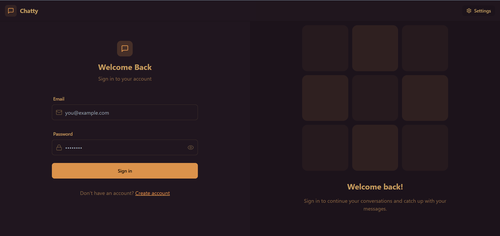
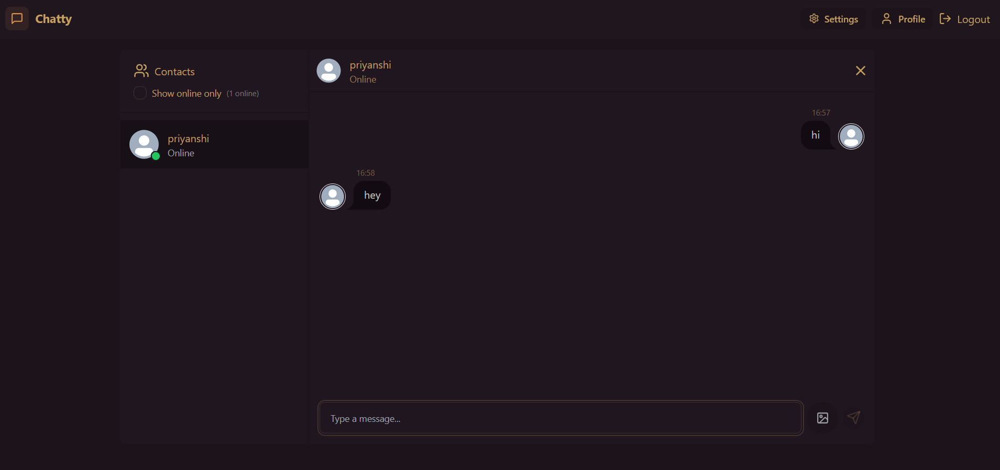
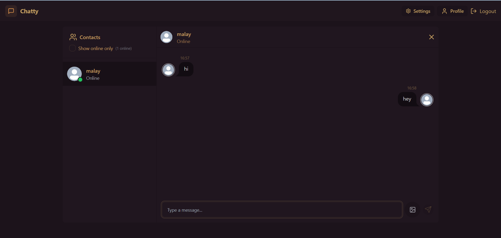
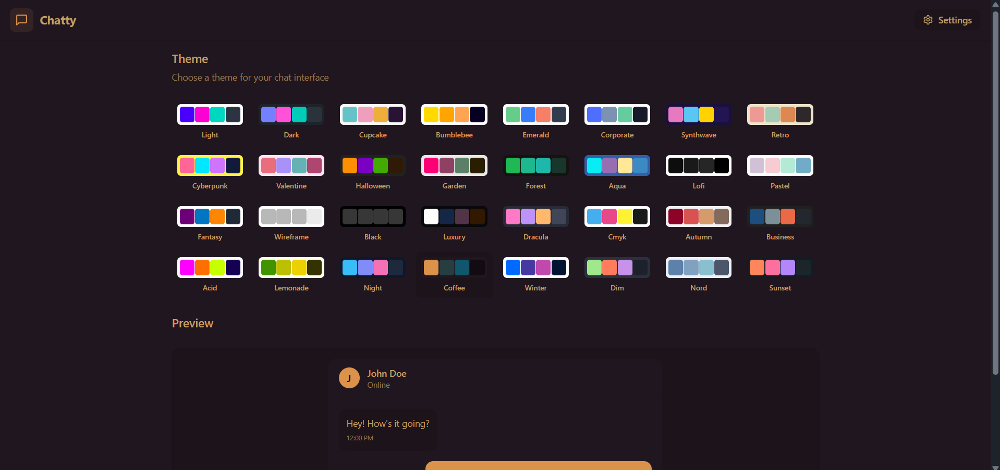
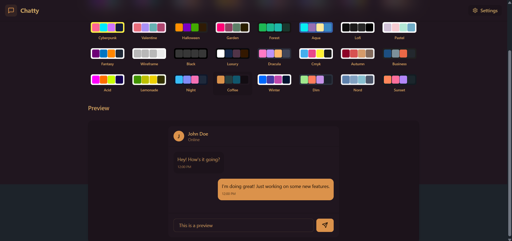
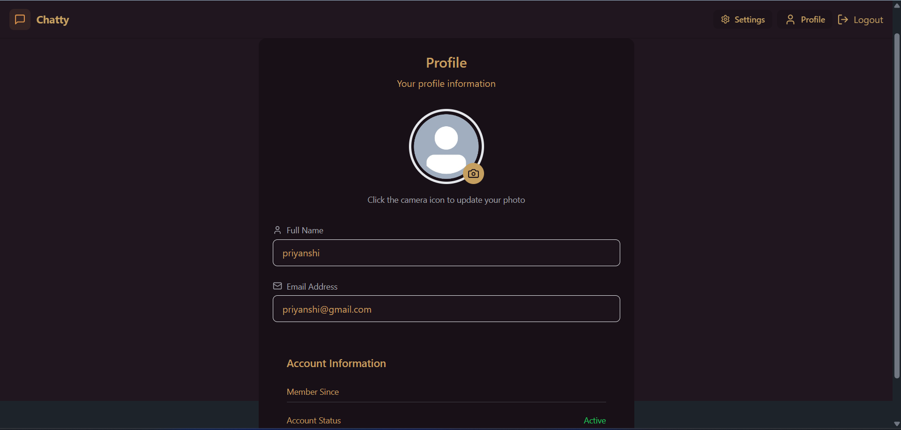

# Chatty 💬

Chatty is a full-stack real-time chat application built using Docker. It supports real-time messaging, authentication, profile management, and UI theme customization.

## Features
- Real-time messaging using Socket.io
- User authentication (Login / Signup)
- Profile management
- Multiple UI themes
- Online/offline user status
- Modern responsive UI

## Tech Stack
- Frontend: React, Tailwind CSS
- Backend: Node.js, Express
- Database: MongoDB
- Real-time Communication: Socket.io
- Containerization: Docker

## Running the Project (Docker)
- docker compose
- docker compose up -d --build

## Open in browser:
- http://localhost:8080

## Screenshots

### Signin and Register

### Chat Interface

### Theme Selection

### Profile Page

